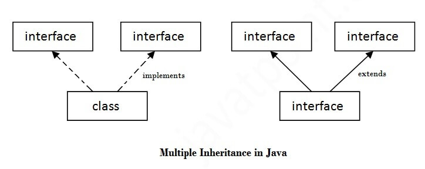

# **Object Oriented Programming System (OOPS) Concepts**

# Table of Contents
- [Object-Oriented Programming System (OOPS) Concepts](#object-oriented-programming-system-oops-concepts)
  - [What is OOPS](#what-is-oops)
  - [Why is OOPS](#why-oops)
  - [Classes and Objects](#class-and-object)
  - [`this` Keyword](#this-keyword)
  - [Constructors](#constructor)
    - [Non-Parameterized Constructor](#non-parameterized-constructor)
    - [Parameterized Constructor](#parameterized-constructor)
    - [Copy Constructor](#copy-constructor)
  - [Difference between `Constructor` and `Method](#difference-between-constructor-and-method)
  - [Polymorphism](#polymorphism)
    - [Compile-Time Polymorphism](#compile-time-polymorphism-static)
      - [Method Overloading](#method-overloading)
    - [Runtime Polymorphism](#runtime-polymorphism-dynamic)
      - [Method Overriding](#method-overriding)
  - [Inheritance](#inheritance)
    - [Single Inheritance](#single-inheritance)
    - [Multilevel Inheritance](#multi-level-inheritance)
    - [Hierarchical Inheritance](#hierarchical-inheritance)
  - [Encapsulation](#encapsulation)
    - [Advantages of Encapsulation](#advantages-of-encapsulation)
    - [Package](#package)
    - [Access Modifiers](#access-modifiers)
    - [Encapsulation Defination](#encapsulation-defination)
  - [Abstraction](#abstraction)
    - [Abstract Class](#abstract-class)
      - [Abstract Method](#abstract-method)
    - [Interface](#interface)
    - [Multiple Inheritance by Interface](#multiple-inheritance-by-interface)
    - [Static Keyword](#static-keyword)


```Java
// Code to Convert Jupyter to README.md file (Run the following program on CMD or Bash)
// jupyter nbconvert --to markdown OOPS_Concepts.ipynb --output README.md
```

## **What is OOPS?**

Object Oriented Programming (OOP) is a methodology or paradigm to create a program using classes and objects. It simplifies software development and maintenance by providing some concepts.


<p align="center">
  
  <br>
  <em>Figure 1. OOPs (Object-Oriented Programming System)</em>
</p>


## **Why OOPS?**

- Helps solve complex programming problems.
- Encourages code reuse, reducing redundancy.
- Supports data abstraction and encapsulation.
- Follows a bottom-up approach (unlike procedural programming’s top-down approach).
- Provides flexibility through polymorphism.

## **Class and Object**
_The collection of objects is called class._ It is a logical entity.

### Class
A class can also be defined as a **blueprint** from which you can create an individual object. Class doesn't consume any space.

<span style="color:#CC33CC">**N.B.** The class does not occupy any memory space until an object is instantiated.</span><br>


### Object
An object is a run-time entity. It is an instance of the class. An object can represent a person, place, or any other item. An object can operate on both data members and member functions. 

#### Example:


```Java
class Student {
    String name;
    int age;

    public void getInfo() {
        System.out.println("This is " + this.name + ", age " + this.age);
    }
}

class OOPS {
    public static void main(String[] arg) {
        Student s1 = new Student();
        s1.name = "Ahsanul Karim";
        s1.age = 22;
        s1.getInfo();
    }
}

// Running the main method manually
OOPS.main(null);
```

    This is Ahsanul Karim, age 22
    

<span style="color:#CC33CC">**N.B.** When an object is created using `new`, memory is allocated in the heap, and the reference is stored in the stack memory.</span><br>


## **`"this"` Keyword**

The `this` keyword in Java refers to the current instance of the class.  

In **OOPs**, it is used to:
1. Pass the current object as a parameter to another method.  
2. Refer to the current class instance variable.

## **Constructor**

A **Constructor** is a special method which is invoked automatically at the time of object creation.  

It is used to initialize the data members of new objects generally.
- Constructors have the same name as the **class** or structure.  
- Constructors don’t have a return type (not even `void`).  
- Constructors are only called once, at the time of object creation.

There can be three types of constructors in Java:
1. **Non-Parameterized Constructor**  
2. **Parameterized Constructor**  
3. **Copy Constructor**


<p align="center">
  
  <br>
  <em>Figure 2. Constructor in C++</em>
</p>


### Non-Parameterized Constructor

A constructor **that has no arguments** is known as a **non-parameterized constructor** (or **no-argument constructor**).  
It is invoked at the time of creating an object. If we don’t create one, it is automatically created by Java by default.


#### Example:


```Java
class Student {
    Student() {
        System.out.println("Constructor is Called!");
    }
}

class OOPS {
    public static void main(String[] arg) {
        Student s1 = new Student();
    }
}

// Running the main method manually
OOPS.main(null)
```

    Constructor is Called!
    

### Parameterized Constructor

A **constructor that has parameters** is called a **parameterized constructor**. It is used to provide **different values** to distinct objects.


#### Example:


```Java
class Student {
    String name;
    int age;

    Student(String name, int age) {
        this.name = name;
        this.age = age;
        System.out.println("Constructor is Created for " + name + ", age " + age);
    }
}

class OOPS {
    public static void main(String[] arg) {
        Student s1 = new Student("Md. Ariful Islam", 23);
    }
}

// Running the main method manually
OOPS.main(null)
```

    Constructor is Created for Md. Ariful Islam, age 23
    

### Copy Constructor

A **Copy Constructor** is an overloaded constructor used to declare and initialize an object from another object. There is only a **user-defined copy constructor** in Java (unlike C++, which has a default one too).


#### Example:


```Java
class Student {
    String name;
    int age;

    Student() {
        System.out.println("Default constructor is created");
    }

    Student(Student s1) {
        this.name = s1.name;
        this.age = s1.age;
        System.out.println("Constructor is created for " + name + ", age " + age);
    }
}

class OOPS {
    public static void main(String[] arg) {
        Student s1 = new Student();
        s1.name = "Sharukh";
        s1.age = 24;
        Student s2 = new Student(s1);
    }
}

// Running the main method manually
OOPS.main(null)
```

    Default constructor is created
    Constructor is created for Sharukh, age 24
    

<span style="color:#CC33CC">**N.B.** Unlike languages like C++, **Java has no Destructor**. Instead, Java has an **efficient garbage collector** that deallocates memory automatically.</span><br>


## Difference between `constructor` and `method`:

There are many differences between **constructors** and **methods** in Java. They are given below:

| **Java Constructor** | **Java Method** |
|-----------------------|-----------------|
| A constructor is used to initialize the state of an object. | A method is used to expose the behavior of an object. |
| A constructor must not have a return type. | A method must have a return type. |
| The constructor is invoked implicitly. | The method is invoked explicitly. |
| The Java compiler provides a default constructor if you don't have any constructor in a class. | The method is not provided by the compiler in any case. |
| The constructor name must be the same as the class name. | The method name may or may not be the same as the class name. |


## **Polymorphism**

Polymorphism is the ability to present the same interface for differing underlying forms (data types). With polymorphism, each of these classes will have different underlying data. Precisely, **Poly** means **'many'** and **morphism** means **'forms'**.

**Types of Polymorphism:**
1. **Compile-Time Polymorphism (Static)**
2. **Runtime Polymorphism (Dynamic)**

### Compile-Time Polymorphism (Static):

The polymorphism which is implemented at **compile time** is known as **compile-time polymorphism**. Example: - **Method Overloading**

#### `Method Overloading`:

If a class has multiple methods having the same name but different parameters, it is known as **`Method Overloading`**. There are two ways to overload a method in Java:
1. By changing the number of arguments  
2. By changing the data type


#### Example:


```Java
class Student {
    public void displayInfo(String name) {
        System.out.println(name);
    }
    public void displayInfo(int age) {
        System.out.println(age);
    }
    public void displayInfo(String name, int age) {
        System.out.println(name + " " + age);
    }
}

class OOPS {
    public static void main(String[] arg) {
        Student s1 = new Student();
        s1.displayInfo("Emad", 25);
    }
}

// Running the main method manually
OOPS.main(null)
```

    Emad 25
    

### Runtime Polymorphism (Dynamic):

Runtime polymorphism is also known as dynamic polymorphism. **Function Overriding** is an example of runtime polymorphism.

#### `Method Overriding`:

If a **subclass (child class)** has the same method as declared in the **parent class**, it is known as **`method overriding`** in Java. In other words, if a subclass provides a specific implementation of a method that has been declared by one of its parent classes, it is called method overriding.

**Rules for Java Method Overriding:**
1. The method must have the same name as in the parent class.  
2. The method must have the same parameter(s) as in the parent class.  
3. There must be an **IS-A relationship (inheritance)**.

#### Example:


```Java
class Vehicle {
    void run() {
        System.out.println("Vehicle is running");
    }
}

class Bike extends Vehicle {
    void run() {
        System.out.println("Bike is running safely");
    }
}

class OOPS {
    public static void main(String[] arg) {
        Bike r15 = new Bike();
        r15.run();
    }
}

// Running the main method manually
OOPS.main(null)
```

    Bike is running safely
    

## **Inheritance**

Inheritance in Java is a mechanism in which one object acquires all the properties and behaviors of a parent object.

The idea behind inheritance in Java is that you can create new classes that are built upon existing classes. When you inherit from an existing class, you can **reuse** methods and fields of the parent class. Moreover, you can **add new methods and fields** in your current class as well.


Inheritance represents the **IS-A relationship**, which is also known as a **parent-child relationship**.

**Types of Inheritance:**
1. **Single Inheritance**  
2. **Multi-level Inheritance**  
3. **Hierarchical Inheritance**  
4. **Multiple Inheritance**  
5. **Hybrid Inheritance**


<p align="center">
  
  <br>
  <em>Figure 3. Types of Inheritance</em>
</p>

### Single Inheritance:

When one class inherits another class, it is known as **single-level inheritance**.

#### Example:


```Java
class Employee {
    float salary = 40000;
}

class Programmer extends Employee {
    int bonus = 10000;
}

class OOPS {
    public static void main(String[] arg) {
        Programmer p = new Programmer();
        System.out.println("Programmer salary is:" + p.salary);
        System.out.println("Bonus of Programmer is:" + p.bonus);
    }
}

// Running the main method manually
OOPS.main(null)
```

    Programmer salary is:40000.0
    Bonus of Programmer is:10000
    

### Multi-Level Inheritance:

**Multilevel inheritance** is a process of deriving a class from another derived class. 

#### Example:


```Java
class Employee{  
    float salary = 40000;  
}

class Programmer extends Employee{  
    int bonus = 10000;  
}

class SeniorProgrammer extends Programmer{
    int extraBonus = 20000;
}

class OOPS {
    public static void main(String arg[]) {
        SeniorProgrammer p = new SeniorProgrammer();  
        System.out.println("Programmer salary is:"+p.salary);  
        System.out.println("Bonus of Programmer is:"+p.bonus);
        System.out.println("Extra Bonus for Senior is:"+p.extraBonus);
    }
}

// Running the main method manually
OOPS.main(null)
```

    Programmer salary is:40000.0
    Bonus of Programmer is:10000
    Extra Bonus for Senior is:20000
    

### Hierarchical inheritance: 


**Hierarchical inheritance** is defined as the process of deriving more than one class from a base class. 

#### Example:


```Java
class Shape {
   public void area() {
       System.out.println("Displays Area of Shape");
   }
}
class Triangle extends Shape {
   public void area(int h, int b) {
       System.out.println((1/2)*b*h);
   }  
}
class Circle extends Shape {
   public void area(int r) {
       System.out.println((3.14)*r*r);
   }  
}

class OOPS {
    public static void main(String arg[]) {
        Circle c1 = new Circle();
        c1.area(3);
        Triangle t1 = new Triangle();
        t1.area();
    }
}

// Running the main method manually
OOPS.main(null)
```

    28.259999999999998
    Displays Area of Shape
    

## **Encapsulation**


Encapsulation in Java is a process of **wrapping code** and **data together** into a single unit — for example, a capsule which is a mix of several medicines.

We can create a fully encapsulated class in Java by making all the data members of the class **private**. Then we use **setter** and **getter** methods to set and get the data in it.


### Advantages of Encapsulation

- By providing only a **setter** or **getter** method, you can make the class **read-only** or **write-only**.  
  In other words, you can skip one method type depending on the requirement.

- It provides **control over the data**.  
  For example, you can set validation logic inside the setter method (e.g., allowing only values greater than 100).

- It helps achieve **data hiding** in Java because other classes cannot access the data directly — only through getters and setters.

- The encapsulated class is **easy to test**, so it is **better for unit testing**.

- Modern **IDEs** can automatically generate getters and setters, making it **easy and fast** to create encapsulated classes in Java.


### Package


A **package** is a group of similar types of **classes**, **interfaces**, and **sub-packages**. Packages help organize code and prevent naming conflicts in large projects.

Packages can be **built-in** or **user-defined**.

- **Built-in packages:** `java`, `util`, `io`, etc.  
- **User-defined packages:** Created by the programmer to group related classes.

#### Example of **Built-in packages**:


```Java
import java.util.Scanner;

import java.io.IOException;
```

### Access Modifiers

Access modifiers in Java define the **visibility** of classes, methods, and variables.

1. **Private**  
   - Accessible **only within the same class**.  
   - **Not accessible** from outside the class.

2. **Default (no modifier)**  
   - Accessible **within the same package only**.  
   - **Not accessible** from outside the package.  
   - If no modifier is specified, Java applies the **default** level.

3. **Protected**  
   - Accessible **within the same package**.  
   - Accessible **outside the package via inheritance** (in child classes).  
   - Without inheritance, it’s **not accessible** outside the package.

4. **Public**  
   - Accessible **everywhere**: within the class, outside the class, within the package, and outside the package.


### **Encapsulation Defination**

Encapsulation is the process of combining **data** and **functions** into a single unit called a **class**. In encapsulation, the data is **not accessed directly**; instead, it is accessed through the **functions** defined inside the class.

In simpler words, attributes of a class are kept **private**, and public **getter** and **setter methods** are used to manipulate these attributes.

Thus, encapsulation supports the concept of **data hiding**.

**Data hiding:**  
A language feature used to **restrict access** to members of an object, reducing unwanted dependencies.  
For example, `"protected"` and `"private"` features in Java help implement data hiding.

#### Example:


```Java
class Account {
   public String name;
   protected String email;
   private String password;

   public void setPassword(String password) {
       this.password = password;
   }

   public String getPassword() {
       return password;
   }
}

class OOPS {
   public static void main(String[] args) {
       Account a1 = new Account();
       a1.name = "Green University of Bangladesh";
       a1.email = "hello@green.com";
       a1.setPassword("abcd");

       System.out.println("Your Password is: " + a1.getPassword());
   }
}

// Running the main method manually
OOPS.main(null)
```

    Your Password is: abcd
    

## **Abstraction**

Abstraction is the process of **hiding the implementation details** and **showing only the functionality** to the user.  

It displays only the **essential features** of an object and hides the **complex background details**. For example, when sending an SMS, you type the message and press send — you don’t see the internal process of how the message is delivered.

Abstraction helps you **focus on what an object does** rather than **how it does it**.

#### Ways of Achieving Abstraction:
1. **Abstract Class** – Achieves partial abstraction (0% to 100%)  
2. **Interface** – Achieves complete abstraction (100%)

### **Abstract Class**

A class that is declared as **abstract** is known as an **abstract class**. It can have both **abstract** and **non-abstract** methods. An abstract class needs to be **extended** and its abstract methods **implemented** by a subclass. It **cannot be instantiated** directly.

**Key Points:**
- An abstract class must be declared using the **`abstract`** keyword.  
- It can contain both **abstract** (without body) and **non-abstract** (with body) methods.  
- It **cannot be instantiated** (objects cannot be created directly).  
- It can include **constructors** and **static methods**.  
- It can have **final methods**, which prevent subclasses from changing the implementation of that method.


#### **Abstract Method**

A **method** that is declared as **abstract** and does **not have an implementation** is known as an **abstract method**. It only provides the **method signature**, and the **subclass** is responsible for providing its **implementation**.


#### <span style="color:#CC33CC">Example: Abstract class that has an **abstract method**.</span><br>


```Java
abstract class Bike {
    abstract void run();
}

class R15 extends Bike {
    void run() {
        System.out.println("Running Safely");
    }
}

class OOPS {
   public static void main(String[] args) {
       R15 bike = new R15();
       bike.run();
   }
}

// Running the main method manually
OOPS.main(null)
```

    Running Safely
    

#### <span style="color:#CC33CC">Example: Abstract class having **constructor**, **data member**, and **methods**.</span><br>


```Java
abstract class Bike{  
    Bike(){
        System.out.println("bike is created");
    }  
    
    abstract void run();  
    
    void changeGear(){
        System.out.println("gear changed");
    }  
 }  

 class R15 extends Bike{  
    void run(){
        System.out.println("running safely..");
    }  
 }  


class OOPS {
   public static void main(String args[]) {
        R15 bike = new R15();  
        bike.run(); 
        bike.changeGear();
   }
}

// Running the main method manually
OOPS.main(null)

```

    bike is created
    running safely..
    gear changed
    

### **Interface**

An **interface** in Java is a **blueprint of a class**. It contains **static constants** and **abstract methods**. The interface in Java is a mechanism to achieve **abstraction**. It can contain only **abstract methods** (no method body). Interfaces are used to achieve both **abstraction** and **multiple inheritance** in Java.

In other words, interfaces can have **abstract methods** and **variables**, but they **cannot have method bodies**.


**Key Points about Interfaces:**
- All fields in interfaces are **public**, **static**, and **final** by default.  
- All methods are **public** and **abstract** by default.  
- A class that implements an interface must **implement all the methods** declared in the interface.  
- Interfaces support the functionality of **multiple inheritance** in Java.


#### Example:


```Java
interface Drawable {
    void draw();
}

class Circle implements Drawable {
    public void draw() {
        System.out.println("Drawing Circle");
    }
}

class OOPS {
   public static void main(String[] args) {
       Circle c1 = new Circle();
       c1.draw();
   }
}

// Running the main method manually
OOPS.main(null)
```

    Drawing Circle
    

### **Multiple Inheritance by Interface**

If a class **implements multiple interfaces**, or if an **interface extends multiple interfaces**, it is known as **multiple inheritance** in Java. This allows a class to inherit the properties and behaviors of more than one interface.


<p align="center">
  
  <br>
  <em>Figure 4. Multiple Inheritance in Java</em>
</p>


#### Example:


```Java
interface Printable {
    void print();
}

interface Showable {
    void show();
}

class Test implements Printable, Showable {
    public void print() {
        System.out.println("Printing...");
    }
    public void show() {
        System.out.println("Showing...");
    }
}

public class OOPS {
    public static void main(String[] args) {
        Test obj = new Test();
        obj.print();
        obj.show();
    }
}

// Running the main method manually
OOPS.main(null)
```

    Printing...
    Showing...
    

### Static Keyword

The **static** keyword in Java is used for memory management. It can be applied to variables, methods, blocks, and nested classes.

**Static can be:**
- **Variable** (also known as a *class variable*)  
- **Method** (also known as a *class method*)  
- **Block**  
- **Nested class**

#### Example:


```Java
class Student {
   static String school;
   String name;
}

public class OOPS {
   public static void main(String[] args) {
       Student.school = "The Scholars' College";
       Student s1 = new Student();
       Student s2 = new Student();

       s1.name = "Meena";
       s2.name = "Raju";

       System.out.println(s1.school);
       System.out.println(s2.school);
   }
}

// Running the main method manually
OOPS.main(null)
```

    The Scholars' College
    The Scholars' College
    
